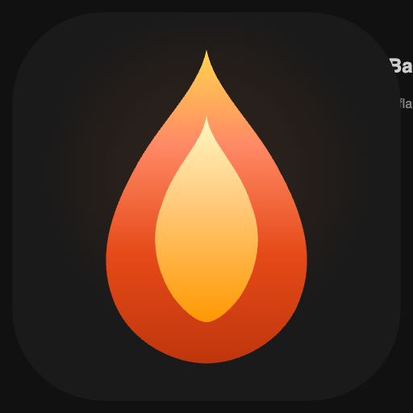

# EmberBar

A native macOS menu bar app for Claude Max users. Tracks your 5-hour session usage in real time — burn rate predictions, peak hour warnings, and smart notifications, all without opening a dashboard.



---

## Features

- **Live session gauge** — circular ring icon updates with your current % used
- **Burn rate prediction** — see your current pace and estimated time until the limit
- **Peak hour detection** — warns you when Claude's 2× counting window is active (9am–5pm PST weekdays)
- **Weekly usage** — track your 7-day rolling window alongside the 5-hour session
- **Smart notifications** — optional alerts at 75%, 90%, and on fast burn rate
- **Privacy-first** — no accounts, no telemetry, no analytics; runs entirely on your Mac

---

## Requirements

- macOS 13 Ventura or later
- An active **Claude Max** subscription ($100/mo plan)

---

## Installation

### Pre-built (recommended)

Download the latest `.dmg` from [Releases](https://github.com/a-earles/EmberBar/releases), open it, and drag **EmberBar.app** to your Applications folder.

> On first launch, macOS will block the app (it's not notarised yet). Open Terminal and run:
> ```
> xattr -cr /Applications/EmberBar.app
> ```
> Then open EmberBar from Applications normally. You only need to do this once.

### Build from source

```bash
git clone https://github.com/a-earles/EmberBar.git
cd EmberBar/EmberBar
swift build -c release
```

Or use the included build script to produce a `.app` bundle:

```bash
cd EmberBar
./build.sh
```

---

## Setup

### Sign In

EmberBar uses a two-step approach to connect to your Claude account:

1. **Embedded browser sign-in** (recommended) — Click "Sign in to Claude" and log in with your email. EmberBar detects your session automatically. Google sign-in isn't supported in the embedded browser — use your email and verification code instead.

2. **Manual cookie paste** (fallback) — If the browser method doesn't work, you can paste your session cookie manually:
   - Go to [claude.ai](https://claude.ai) in Safari/Chrome
   - Open DevTools (`Cmd+Option+I`) → **Network** tab
   - Refresh the page, click any request to `claude.ai`
   - Copy the `Cookie` header value and paste it into EmberBar

> Your cookie is stored securely in the macOS **Keychain** and never leaves your machine.

### Session expiry

Claude sessions last several weeks. If your session expires, EmberBar will show "Not Connected" and you can sign in again.

---

## Usage

Click the gauge icon in your menu bar to open the popover:

| Section | What it shows |
|---|---|
| **SESSION** | 5-hour rolling window — % used, time left, estimated messages remaining |
| **BURN RATE** | Current pace (Idle / Light / Moderate / Fast) and estimated time to limit |
| **WEEKLY** | 7-day rolling window % |
| **Peak Hours Active** | Appears during 9am–5pm PST weekdays when usage counts 2× |

---

## Settings

| Setting | Default | Description |
|---|---|---|
| Launch at login | On | Start EmberBar automatically on login |
| Refresh interval | 1 min | How often to poll the API |
| Notify at 75% | On | Alert when session hits 75% |
| Notify at 90% | On | Alert when session hits 90% |
| Burn rate warning | On | Alert on sustained fast burn rate |
| Peak hours alert | On | Alert when peak window starts |

---

## FAQ

**Why does the percentage jump suddenly after one message?**
Claude batch-counts tokens at the end of a response, so usage can jump several percent at once. EmberBar uses a linear regression over multiple readings to smooth out these spikes and give a stable burn rate estimate.

**Why do I need to paste a cookie?**
Anthropic doesn't offer a public usage API. The session cookie is the only way to read your own usage data from the same endpoint Claude's web app uses.

**Does EmberBar upload my data anywhere?**
No. The app makes one HTTPS request to `claude.ai` per refresh cycle. No data is sent anywhere else.

**The keyboard shortcut (⌘⇧E) doesn't work.**
This requires Accessibility permission. Go to System Settings → Privacy & Security → Accessibility and add EmberBar.

**The popover appeared on the wrong monitor.**
Known issue — will be fixed in v1.1.

---

## Privacy

- No analytics, no crash reporting, no telemetry
- Your session cookie is stored in macOS Keychain only
- Network requests go only to `claude.ai`

---

## License

MIT — see [LICENSE](LICENSE).
